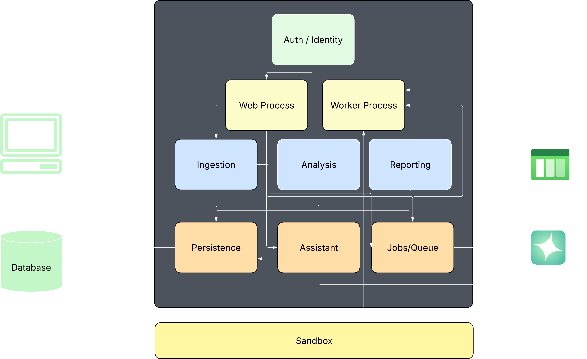

## What it is?

Is an AI-powered platform that analyzes source code, infrastructure, and cloud configurations to identify security risks and explain them in plain language. The platform scans the project, builds a security knowledge base, and allows users to ask questions. Users can upload or connect:
- Git repositories
- Dockerfiles
- Kubernetes manifests
- Terraform/OpenTofu projects
- CI/CD pipelines
- Application configuration files
## Why?

The goal of this project is to deepen our understanding of key areas including Cybersecurity, DevOps, and AI. Additionally, as AI-generated code becomes increasingly prevalent, so does the risk of undetected security vulnerabilities. This project aims to address that challenge by helping identify and resolve those risks.
## Getting Started

### Prerequisites

- **Docker Desktop** (for full-stack Docker Compose or infra dependencies)
- **Python 3.14** and **uv** (for backend dev)
- **Node.js 24+** and **pnpm** (for frontend dev)
- **Git**

---

### Option A: Full stack with Docker Compose (recommended)

Starts everything — Postgres, Redis, pgAdmin, backend, worker, and frontend — in containers.

```bash
cp .env.example .env
docker compose up --build
```

To include the sandbox container (for isolated code analysis):

```bash
docker compose --profile sandbox up --build
```

**Verify it works:**

```bash
curl http://localhost:8000/api/health
# → {"status":"ok"}

curl http://localhost:8000/api/db-check
# → {"database":"ok","select_1":1,...}
```

Open http://localhost:5173 — you should see "Database: ok".

---

### Option B: Backend (local dev)

Run the backend natively with hot-reload. Infra services are still provided via Docker.

```bash
# 1. Start Postgres and Redis
docker compose up postgres redis -d

# 2. Configure environment
cd backend
cp .env.example .env

# 3. Install dependencies
uv sync --frozen

# 4. Run database migrations
uv run alembic upgrade head

# 5. Seed a stub user
uv run python seed.py

# 6. Start the dev server
uv run python main.py
# or: uv run uvicorn main:app --reload
```

Health and DB check endpoints are at `http://localhost:8000/api/health` and `http://localhost:8000/api/db-check`.

---

### Option C: Frontend (local dev)

Requires the backend to be running (Option A or B).

```bash
cd frontend
pnpm install --frozen-lockfile
cp .env.example .env   # defaults to VITE_API_URL=http://localhost:8000
pnpm dev
```

Opens at http://localhost:5173 with HMR.


## Architecture Diagram


