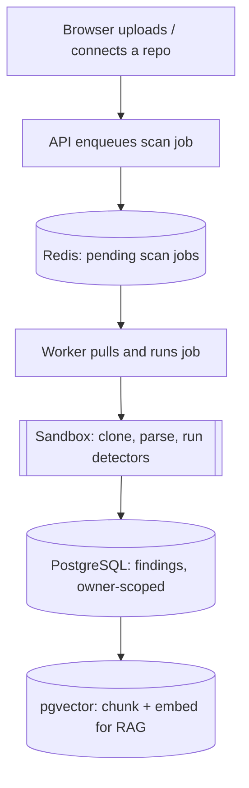
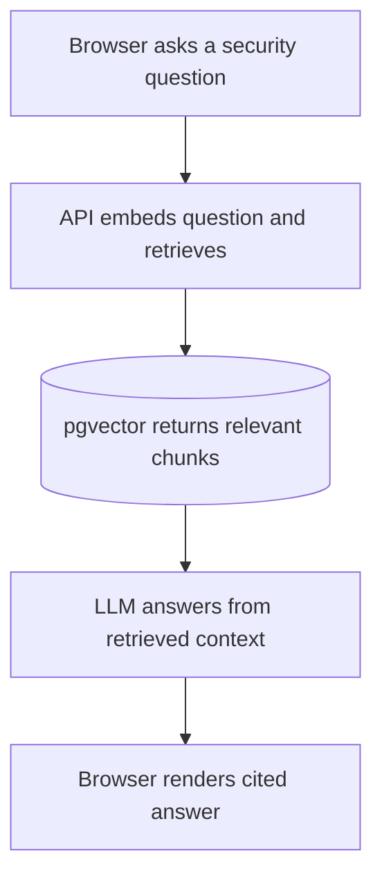

## Components

### Frontend
The client-facing application that **users interact with**. It **communicates exclusively with the Web Process** through the API, and is responsible for displaying scan results, reports, and Q&A responses.

---
### Web Process
The public-facing process that **handles all incoming requests**. It manages authentication, exposes the API endpoints, enqueues background jobs, and serves data reads such as reports and chat history. 

---
### Worker Process
Runs in the background, **consuming jobs from the Message Queue and driving the scan pipeline**. It coordinates the flow between Ingestion, Analysis, Persistence, and the Sandbox. Multiple instances can run in parallel to scale throughput.

---
### Auth / Identity
Owns everything related to users, sessions, and login. Other modules rely on it to **verify who is making a request and whether they have permission** to access a given resource. Ownership rules are enforced here.

---
### Ingestion
Responsible for **accepting repositories** — either via file upload or a remote URL — and preparing them for analysis. It detects project type, lists files, and delegates untrusted content to the Sandbox. It never directly touches repo bytes itself.

---
### Analysis
Contains the detector plugin framework. Each security check (secrets, misconfigurations, vulnerabilities) is a self-contained plugin registered into a registry and run over the Sandbox's output. Detectors are independent of each other, making it easy to add new checks incrementally.

---
### Reporting
**Aggregates findings produced by the Analysis module into structured reports**. Handles severity grouping, PDF/Markdown export, and diff comparisons between scan runs. It is read-only over findings — it composes and formats, but does not detect.

---
### Persistence
The only module that talks directly to the database. It **exposes clean data-access interfaces** (e.g. "save findings", "fetch chunks") to the rest of the system. All queries are scoped to the owning user, preventing any data from leaking across tenants.

---
### Jobs / Queue
**Owns the job queue and the worker entrypoint**. It sequences a full scan job — Ingestion → Sandbox → Analysis → Persistence → embed — and conducts the flow without holding any business logic itself.

---
### Assistant
**Handles the AI-powered Q&A feature**. It chunks and embeds repository content, performs similarity searches, assembles prompts, calls the AI provider, and returns cited answers. It is the only module that communicates with the external AI provider, and it treats all retrieved content as untrusted data.

---
### Sandbox — Isolated
A deliberately separate, **locked-down execution environment**. It is the only place where **untrusted repository content is handled**. It has no access to the database or the network, runs under strict CPU, time, and size limits, and returns only structured findings back to the application. This is what makes the security boundary real.

---
### Database
The system's source of truth. **Stores repositories, scan runs, findings, file chunks, and embeddings.** The vector search capability allows the Assistant to perform similarity-based retrieval for Q&A. All data is scoped per user.

---
### Message Queue
Acts as the communication channel between the Web Process and the Worker Process. **When a scan is triggered, a job is placed in the queue and picked up asynchronously by a worker**, decoupling request handling from long-running scan execution.

---
### AI Provider
**An external service that generates natural language responses**. It is called exclusively by the Assistant module and receives only structured, sanitized prompts — never raw repository content directly.
## Data flow

#### Upload data 

#### Request data

## Schema

See [SCHEMA.md](SCHEMA.md).

## Tech Stack

See [ADR 0001: Technology stack](../adr/0001-technology-stack.md).
