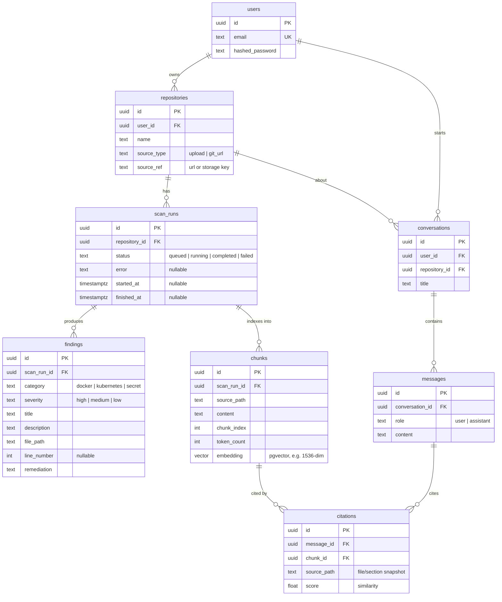

# Schema

```mermaid

erDiagram

    users ||--o{ repositories : owns

    users ||--o{ conversations : starts

    repositories ||--o{ scan_runs : "has"

    repositories ||--o{ conversations : "about"

    scan_runs ||--o{ findings : produces

    scan_runs ||--o{ chunks : "indexes into"

    conversations ||--o{ messages : contains

    messages ||--o{ citations : cites

    chunks ||--o{ citations : "cited by"

  

    users {

        uuid id PK

        text email UK

        text hashed_password

    }

    repositories {

        uuid id PK

        uuid user_id FK

        text name

        text source_type "upload | git_url"

        text source_ref "url or storage key"

    }

    scan_runs {

        uuid id PK

        uuid repository_id FK

        text status "queued | running | completed | failed"

        text error "nullable"

        timestamptz started_at "nullable"

        timestamptz finished_at "nullable"

    }

    findings {

        uuid id PK

        uuid scan_run_id FK

        text category "docker | kubernetes | secret"

        text severity "high | medium | low"

        text title

        text description

        text file_path

        int line_number "nullable"

        text remediation

    }

    chunks {

        uuid id PK

        uuid scan_run_id FK

        text source_path

        text content

        int chunk_index

        int token_count

        vector embedding "pgvector, e.g. 1536-dim"

    }

    conversations {

        uuid id PK

        uuid user_id FK

        uuid repository_id FK

        text title

    }

    messages {

        uuid id PK

        uuid conversation_id FK

        text role "user | assistant"

        text content

    }

    citations {

        uuid id PK

        uuid message_id FK

        uuid chunk_id FK

        text source_path "file/section snapshot"

        float score "similarity"

    }

```
